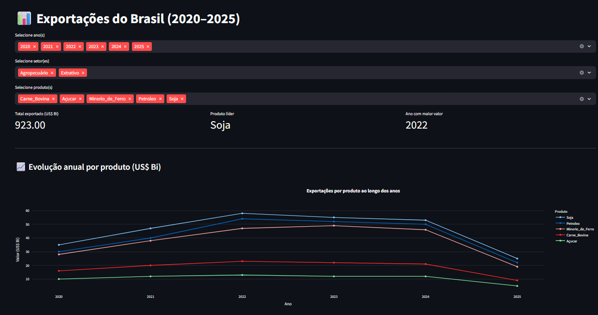
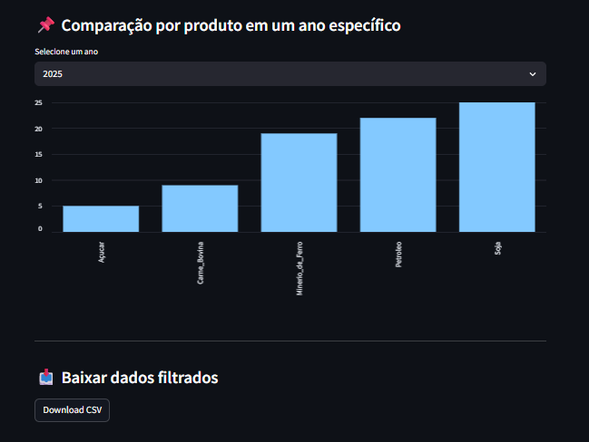
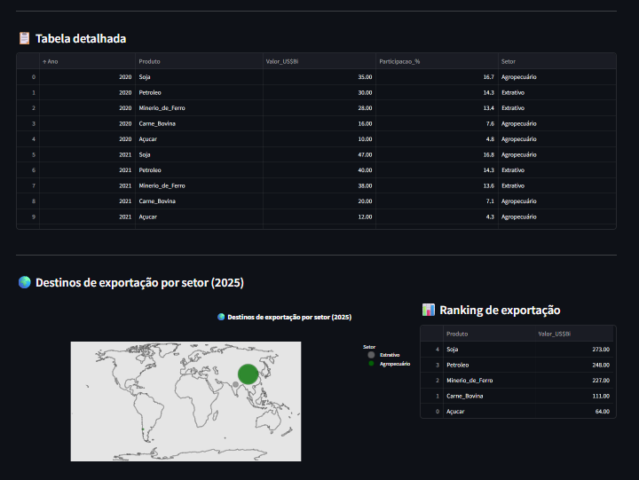

# 📊 Projeto de Visualização de Dados – Exportações do Brasil (2020–2025)

Este projeto apresenta um dashboard interativo desenvolvido com **Streamlit**, que permite explorar dados públicos de exportações brasileiras por produto, setor econômico e destino internacional. A aplicação combina visualizações dinâmicas, filtros inteligentes e recursos analíticos para facilitar a compreensão de padrões comerciais entre 2020 e 2025.

---

## 🎯 Objetivo

- Transformar dados brutos de comércio exterior em insights visuais acessíveis.
- Permitir análises comparativas entre produtos, anos e setores econômicos.
- Identificar os principais destinos das exportações brasileiras.
- Demonstrar domínio técnico em visualização de dados para fins de portfólio.

---

## 🔗 Fontes de dados

- [ComexStat – Estatísticas de Comércio Exterior](https://comexstat.mdic.gov.br/)
- MDIC/SECEX – Ministério do Desenvolvimento, Indústria, Comércio e Serviços
- IBGE – Projeções populacionais
- AEB – Associação de Comércio Exterior do Brasil
- Dados complementares fictícios para fins didáticos e visuais

---

## 🛠️ Tecnologias e ferramentas utilizadas

| Ferramenta     | Finalidade                                  |
|----------------|---------------------------------------------|
| **Python**     | Manipulação de dados e lógica do app        |
| **Pandas**     | Limpeza, filtragem e agregação dos dados    |
| **Streamlit**  | Criação do dashboard interativo             |
| **Plotly**     | Visualizações interativas (linha, mapa)     |
| **VS Code**    | Ambiente de desenvolvimento                 |
| **GitHub**     | Versionamento e publicação do projeto       |

---

## 🚀 Funcionalidades do dashboard

- Filtros por ano, produto e setor econômico
- KPIs dinâmicos: total exportado, produto líder, ano com maior valor
- Gráfico de linha por produto: evolução anual
- Gráfico de barras: comparação por produto em um único ano
- Tabela detalhada com ordenação e formatação
- Download dos dados filtrados em CSV
- Mapa interativo com destinos de exportação
- Ranking lateral por valor exportado

---

## 📈 Visualizações e significados

- **Linha temporal por produto:** mostra a evolução anual das exportações em US$ bilhões.
- **Ranking lateral:** ordena os produtos pelo valor total exportado.
- **Tabela detalhada:** apresenta os dados filtrados com formatação clara.
- **Mapa interativo:** exibe os principais destinos de exportação por produto, com cores distintas.
- **Comparação anual:** destaca os produtos líderes em um ano específico.

---

## 📸 Parte do Dashboard

### Topo

### Meio

### Base


---

## 🌍 Mapa interativo + Ranking

O dashboard exibe um **mapa interativo** com os principais destinos de exportação por produto, com cores distintas e legenda. Ao lado, o **ranking de exportação** mostra os produtos ordenados pelo valor total exportado no período filtrado.

Ambos os elementos são reativos aos filtros de ano, produto e setor.

---

## ▶️ Como executar

No terminal:

```bash
pip install streamlit pandas plotly
streamlit run streamlit_app.py
